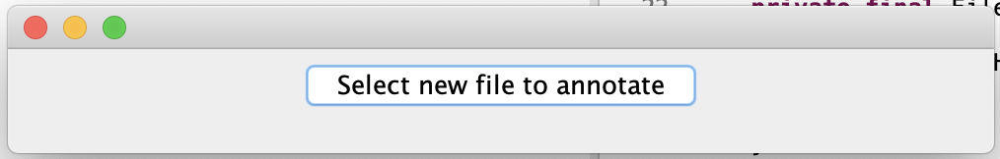

# Fundies2Helper

Auto-generates class templates via `java.lang.reflect.*` and some hacky methods.  

## Usage

1. Download the JAR from [here](https://github.com/Makiah/Fundies2Helper/releases/download/1.0/helper.jar).  
2. Double click on the file to run it, which should result in a pop up.  
2. Provide the GUI a .java file by clicking "Select new file to annotate".  

</img>
